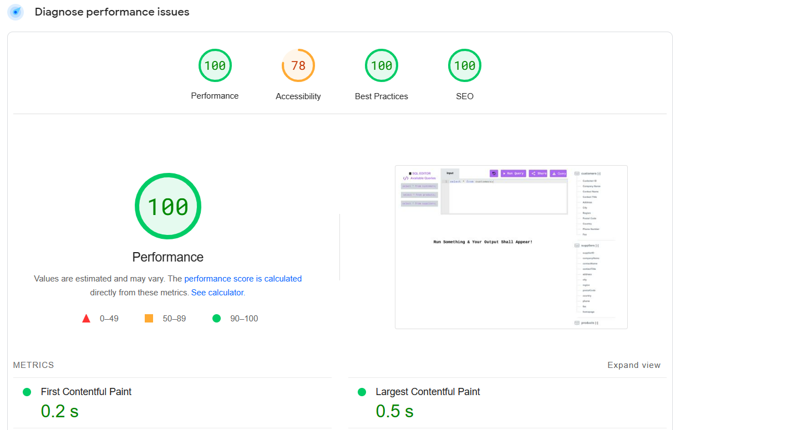
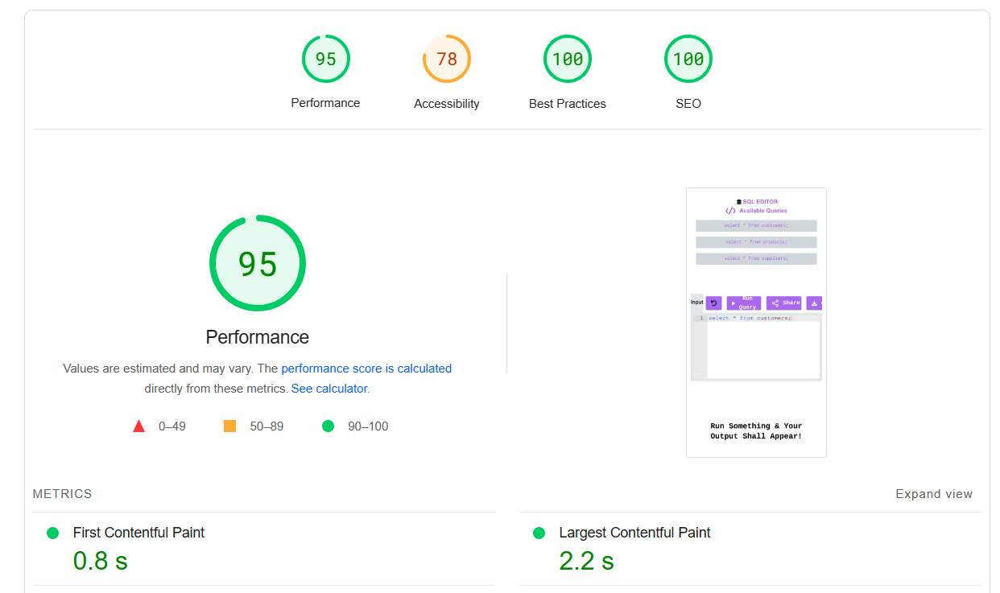
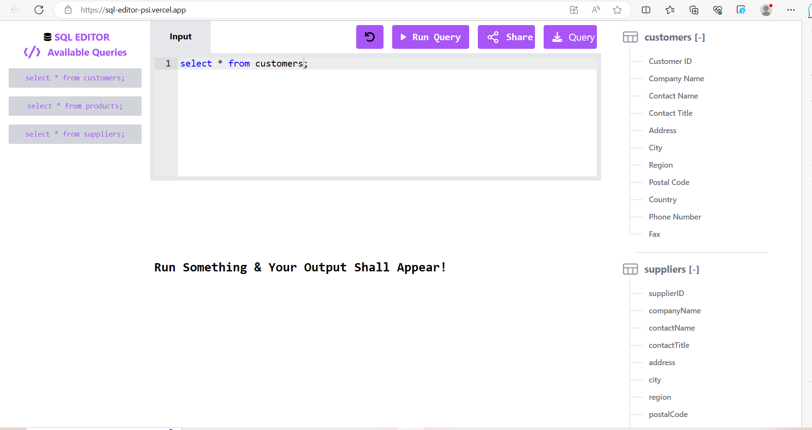

# 💻 REACT SQL Editor

## 📚 Description

Create, design and implement a web-based application capable of running SQL queries and displaying the results of said query. The application must include a space which accepts SQL queries in the form of user inputs, then runs the given query, and displays the result within the application..

This is a REACT SQL Editor built using ReactJs and TailwindCSS.

## 👨‍💻 Live Demo

Try out the website : [REACT SQL Editor](https://sql-editor-psi.vercel.app/)

##  Tech Stack

##  Dependencies

- **_react-ace_**
- **_react-csv_**
- **_react-json_**
- **_react-icon_**
- **_react-hot-toast_**
- **_react-social-share_**
- **_tailwind-scrollbar-hide_**
  

## 👨‍💻 Features

:white_check_mark: Users can get data of any of the availables SQL queries on the left Sidebar menu.\
:white_check_mark: Users can view all the table column on Right Sidebar menu.\
:white_check_mark: Users can check all the table value on clicking Table name of Right Sidebar menu.\
:white_check_mark: Users can download the data in CSV Format in just one click.\
:white_check_mark: Users can download the data in JSON Format in just one click.\
:white_check_mark: Users can download the history Query in the format text file with date and time .\
:white_check_mark: Users can use share button  for whatsapp share and add collaborator using the mail id .\
:white_check_mark: Users can see query runtime in milliseconds(ms).

## ✍️ Predefined SQL Queries

- `select * from customers;`
- `select * from suppliers;`
- `select * from products;`

## ⏱ Page Load Time

Page Load time of this website in desktop is in the range of 0.2 s to 0.5s.
speed index-0.9s total blocking time 0 s
we can check code spnappyness GTmetrix Grade.

### [web.dev Report](https://pagespeed.web.dev/)

Laptop performance view

Mobile performance view

## 🪜 Steps I took to optimize the page load time

- Used Lighthouse DevTools Extension to find the performance issues and fix them using their actionable suggestion.
- Used vercel to deploy this website.

## Available Scripts

In the project directory, you can run:

### `npm install`

To install all the packages in package.json. This will install all the dependencies and devDependencies.

### `npm start`

Runs the app in the development mode.\
Open [http://localhost:3000](http://localhost:3000) to view it in the browser.

The page will reload if you make edits.\
You will also see any lint errors in the console.

### `npm run build`

Builds the app for production to the `build` folder.\
It correctly bundles React in production mode and optimizes the build for the best performance.

The build is minified and the filenames include the hashes.\
Your app is ready to be deployed!

See the section about [deployment](https://facebook.github.io/create-react-app/docs/deployment) for more information.

## 🚀 Project Output

